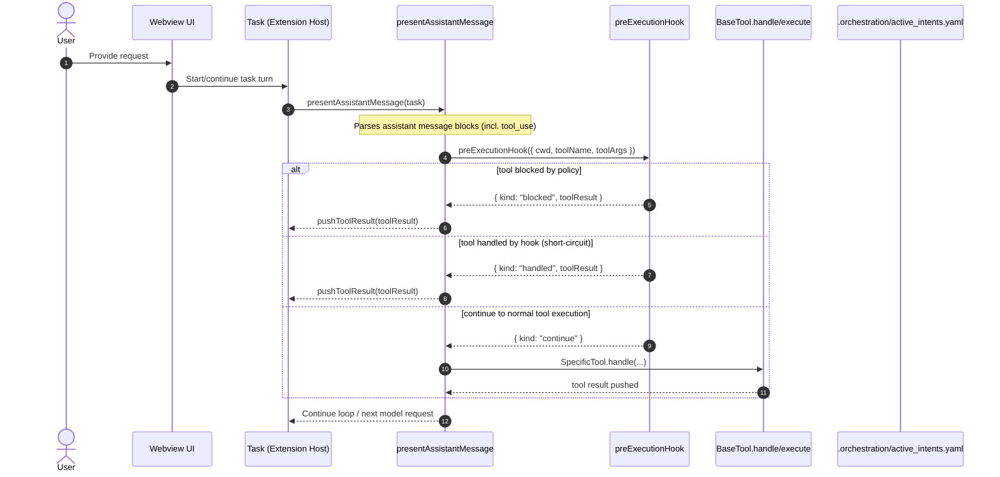

# ARCHITECTURE_NOTES — Roo Code (TRP1 Week 1)

This document maps the **Extension Host** execution flow for Roo Code’s agent tool loop, the **system prompt construction** path, and the current **hook insertion points** used for intent-first governance.

Scope (per project instructions):

- Focus on extension-host (TypeScript) logic.
- Ignore webview UI details except where they trigger system prompt generation.
- Provide concrete file paths and function/class names (no guesses).

---

## 1) Repository landmarks

- VS Code extension package: `roo-code/src/`
- Tool loop (tool execution dispatch): `roo-code/src/core/assistant-message/presentAssistantMessage.ts`
- Task orchestration / streaming loop: `roo-code/src/core/task/Task.ts` (calls `presentAssistantMessage(...)` repeatedly)
- System prompt builder:
    - Entry from webview: `roo-code/src/core/webview/generateSystemPrompt.ts` (`generateSystemPrompt`)
    - Core prompt assembly: `roo-code/src/core/prompts/system.ts` (`SYSTEM_PROMPT`)
- Native tool schema registry: `roo-code/src/core/prompts/tools/native-tools/index.ts` (`getNativeTools`)
- Hook engine (pre-tool boundary): `roo-code/src/hooks/pre-execution.ts` (`preExecutionHook`)
- Sidecar state:
    - `.orchestration/active_intents.yaml`

---

## 2) The Tool Execution Loop (user prompt → tool call → tool result)

### Key files / symbols

- `roo-code/src/core/task/Task.ts`
    - `recursivelyMakeRooRequests()` (drives the turn loop and invokes tool handling)
- `roo-code/src/core/assistant-message/presentAssistantMessage.ts`
    - `presentAssistantMessage(cline: Task)` (main tool-use dispatcher)
    - `switch (block.name)` (dispatches each tool use to the corresponding tool implementation)
- Tool implementations (examples):
    - `roo-code/src/core/tools/ExecuteCommandTool.ts`
    - `roo-code/src/core/tools/WriteToFileTool.ts`
    - `roo-code/src/core/tools/ApplyDiffTool.ts`
    - `roo-code/src/core/tools/SelectActiveIntentTool.ts`
- Universal tool entrypoint:
    - `roo-code/src/core/tools/BaseTool.ts` (`BaseTool.handle()` parses args and calls `execute(...)`)

### Sequence diagram: tool_use dispatch and execution

### Where the tool switch lives

Tool dispatch is performed inside:

- `roo-code/src/core/assistant-message/presentAssistantMessage.ts` → `presentAssistantMessage(...)`

This is the central “hub” where each tool use (e.g., `write_to_file`, `execute_command`, `apply_diff`) is routed to its corresponding tool implementation.

---

## 3) Hook Insertion Points (Deterministic Middleware Boundary)

### Pre-execution hook (current)

- Hook implementation: `roo-code/src/hooks/pre-execution.ts`

    - Exported entrypoint: `preExecutionHook({ cwd, toolName, toolArgs })`
    - Result contract: `PreExecutionHookResult` with `continue | blocked | handled`

- Hook integration point: `roo-code/src/core/assistant-message/presentAssistantMessage.ts`
    - There is an explicit comment: `// Pre-execution middleware boundary (Day 2 Hook Engine scaffold).`
    - The dispatcher calls `preExecutionHook(...)` before executing tools.

### What the pre-hook currently enforces

`preExecutionHook` implements two core behaviors:

1. **Gatekeeper:** blocks _all_ tools until an active intent is selected.

    - Condition: `toolName !== "select_active_intent"`
    - Reads `.orchestration/active_intents.yaml` and checks `active_intent_id` exists and references a valid intent.
    - Block message (returned as tool result):
        - `Error: You must first declare an active intent using select_active_intent(intent_id) before performing any other actions.`

2. **Handshake interception:** intercepts `select_active_intent` tool calls.
    - Extracts `intent_id` from tool args
    - Loads intent from YAML
    - Persists selection by setting `active_intent_id`
    - Returns a minimal XML block:
        - `<intent_context>` containing only **id, title, constraints, scope paths**

### Sidecar schema compatibility

The hook supports both:

- Plan-doc style: `active_intents: [ { id, name, owned_scope, constraints } ]`
- Repo style (current file): `active_intent_id` + `intents: [ { id, title/name, scope.paths/owned_scope, constraints } ]`

Source of truth for this behavior: `roo-code/src/hooks/pre-execution.ts` (`ActiveIntentsFileAny`, `findIntent(...)`).

---

## 4) Intent Handshake (Day 2) — tool + prompt + sidecar

### 4.1 Tool schema (LLM-facing)

- `roo-code/src/core/prompts/tools/native-tools/select_active_intent.ts`

    - OpenAI tool definition: `name: "select_active_intent"`
    - Parameter: `intent_id` of type `["string", "null"]`

- Registry: `roo-code/src/core/prompts/tools/native-tools/index.ts`
    - Imported as `selectActiveIntent` and included in `getNativeTools()` list.

### 4.2 Tool implementation (extension-side)

- `roo-code/src/core/tools/SelectActiveIntentTool.ts`
    - Class: `SelectActiveIntentTool extends BaseTool<"select_active_intent">`
    - Note: Even though the tool has an implementation that can set/clear intent, **the hook layer can short-circuit** tool execution and return the XML context directly.

### 4.3 System prompt enforcement

System prompt contains strict instruction requiring handshake first:

- `roo-code/src/core/prompts/system.ts`
    - `handshakeProtocol` string:
        - “Your first action … MUST be … call the select_active_intent tool … After you receive <intent_context>, you may proceed …”

### 4.4 Sidecar file

- `.orchestration/active_intents.yaml`
    - Contains sample intents and an `active_intent_id` field.

---

## 5) Prompt Construction Area (system prompt assembly)

### Entry points

- Webview request path:

    - `roo-code/src/core/webview/webviewMessageHandler.ts` (calls `generateSystemPrompt` during preview/refresh flows)
    - `roo-code/src/core/webview/generateSystemPrompt.ts` → `generateSystemPrompt(provider, message)`

- Core builder:
    - `roo-code/src/core/prompts/system.ts` → `SYSTEM_PROMPT(...)`

### Prompt composition (high-level)

`SYSTEM_PROMPT(...)` builds a single prompt string from:

- role definition / mode selection
- mandatory handshake instruction (`handshakeProtocol`)
- shared tool use guidelines + rules
- system info
- **active intent prompt section** (minimal summary):
    - `roo-code/src/core/intents/activeIntent.ts` → `getActiveIntentPromptSection(cwd)`

Note: tool schemas are **not embedded** in the system prompt; they’re passed to the model as API metadata elsewhere (see `getNativeTools()` usage from task build tools).

---

## 6) Minimal debugging / validation checkpoints

### Breakpoint proof (Day 1 / Day 2 validation)

Set a breakpoint in:

- `roo-code/src/hooks/pre-execution.ts` → inside `preExecutionHook(...)`

Then run VS Code “Run Extension” and trigger any tool call (or a request that causes the model to call a tool). You should see:

- `toolName` and `toolArgs` populated
- For first-turn behavior, the model should call `select_active_intent` before any write/command tools.

---

## 7) Known boundaries for next phases (for reference)

This Week 1 project later expects:

- HITL command gating (e.g., via `ExecuteCommandTool` approval boundary)
- Scope enforcement on write tools (owned scope patterns)
- Post-execution hook for trace append + SHA-256 hashing into `.orchestration/agent_trace.jsonl`
- Concurrency controls / stale write prevention

These are _not_ implemented in this document; they’re listed to clarify where future hooks will attach.
