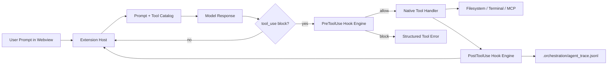
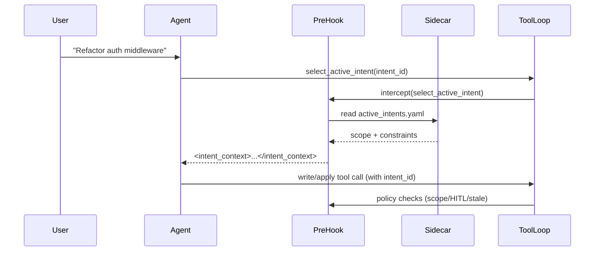

# B1W1 Final Report: Architecting a Governed AI-Native IDE

**Course/Track:** 10 Academy — TRP1 Intensive Training  
**Codebase:** Fork of Roo Code  
**Branch:** `feature/intent-handshake`  
**Current Commit:** `ff1c04013`  
**Date:** 2026-02-21

## 1. Executive Summary

This project upgrades Roo Code into a governed AI-native IDE workflow where autonomous tool execution is controlled by deterministic hooks and tied to business intent. The implementation delivers four core outcomes:

1. **Intent-first execution:** no mutating tool may run until `select_active_intent(intent_id)` succeeds.
2. **Governance boundary:** destructive actions and out-of-scope writes are blocked at PreToolUse.
3. **AI-native traceability:** successful writes append immutable trace entries with deterministic SHA-256 content hashes.
4. **Parallel safety:** optimistic locking rejects stale writes until files are re-read.

The resulting system addresses both **trust debt** (traceable intent→code attribution) and **context debt** (explicit sidecar-managed intent context).

---

## 2. Complete Implementation Scope

### 2.1 Sidecar Orchestration Layer

- `.orchestration/active_intents.yaml`
    - Source of truth for active intent ID, owned scope, and constraints.
- `.orchestration/agent_trace.jsonl`
    - Append-only Agent Trace ledger with commit anchoring and content hashing.
- `.orchestration/intent_map.md`
    - Human-readable map from intent IDs to implementation surfaces.
- `CLAUDE.md`
    - Shared-brain operational memory and lessons learned.

### 2.2 Hook & Middleware Layer

- `src/hooks/pre-execution.ts`
    - Handshake gate, scope policy checks, destructive-command HITL, stale-write rejection.
- `src/hooks/postToolHook.ts`
    - Post-tool snapshot capture and trace-related post-processing.
- `src/hooks/engine.ts`
    - Hook orchestration entrypoint; keeps middleware isolated from core tool loop.

### 2.3 Tool Loop & Prompt Integration

- `src/core/assistant-message/presentAssistantMessage.ts`
    - Deterministic integration point for pre/post hook interception around tool execution.
- `src/core/prompts/system.ts`
    - Enforces intent-first behavior in system-level instructions.
- `src/core/tools/SelectActiveIntentTool.ts`
    - Handshake tool used to bind runtime work to a valid active intent.

### 2.4 Traceability & Hashing Layer

- `src/hooks/trace/agentTrace.ts`
    - Serializes and appends Agent Trace records.
- `src/utils/hash.ts`
    - Deterministic SHA-256 generation (`sha256:<hex>`) with newline normalization.
- `src/hooks/locking/readHashStore.ts`
    - Read-time snapshot ledger for optimistic locking.

---

## 3. Architecture Schemas

### 3.1 Runtime Boundary Schema



### 3.2 Two-Stage Reasoning Handshake



### 3.3 Agent Trace Record Schema (Implemented Form)

```json
{
	"id": "uuid-v4",
	"timestamp": "RFC3339",
	"vcs": { "revision_id": "git_sha" },
	"files": [
		{
			"relative_path": "src/path/file.ts",
			"conversations": [
				{
					"url": "session_or_proof_url",
					"contributor": {
						"entity_type": "AI",
						"model_identifier": "gpt-5.3-codex"
					},
					"ranges": [
						{
							"start_line": 10,
							"end_line": 42,
							"content_hash": "sha256:..."
						}
					],
					"related": [
						{ "type": "specification", "value": "INT-001" },
						{ "type": "mutation_class", "value": "AST_REFACTOR" }
					]
				}
			]
		}
	]
}
```

---

## 4. Agent Flow and Hook System Breakdown

### 4.1 PreToolUse Decision Pipeline

1. **Intent Gate:** If tool ≠ `select_active_intent` and no valid active intent exists, block.
2. **Scope Gate:** For write-capable tools, verify target path matches `owned_scope` / `scope.paths`.
3. **Stale-Write Gate:** Require prior read snapshot; compare current hash vs read-time hash.
4. **HITL Gate:** For destructive `execute_command`, require explicit user approval.
5. **Structured Recovery:** Return deterministic tool errors so the agent can re-plan safely.

### 4.2 PostToolUse Responsibilities

1. Capture read snapshots from read-oriented tools.
2. On successful writes, compute deterministic content hash(es).
3. Append a trace entry to `.orchestration/agent_trace.jsonl`.
4. Keep side effects append-only and auditable.

### 4.3 Why This Design Works

- Prompt instructions are probabilistic; hooks are deterministic.
- Governance is enforced **before** side effects.
- Evidence is recorded **after** successful side effects.
- Concurrency conflict is detected using content identity rather than mutable line positions.

---

## 5. Validation and Proof of Execution

### 5.1 Automated Proof Suite

Executed command:

`pnpm.cmd exec vitest run hooks/__tests__/agentTrace.day4.spec.ts hooks/__tests__/preExecutionHook.day3.spec.ts hooks/__tests__/preExecutionHook.day5-locking.spec.ts hooks/__tests__/optimisticLocking-codebaseSearch.spec.ts hooks/__tests__/optimisticLocking-searchFiles.spec.ts hooks/__tests__/optimisticLocking-accessMcpResource.spec.ts hooks/__tests__/optimisticLocking-listFiles.spec.ts`

Evidence:

- `report-assets/final-proof-test-output-v2.txt`
- `FINAL_PROOF_WORKFLOW.md`

Results:

- **7 test files passed**
- **23 tests passed**

### 5.2 Requirement-to-Test Mapping

- Intent/guardrail enforcement → `preExecutionHook.day3.spec.ts`
- Stale write rejection → `preExecutionHook.day5-locking.spec.ts` + optimistic locking suite tests
- Trace append correctness → `agentTrace.day4.spec.ts`

---

## 6. Achievement Summary

### 6.1 Technical Achievements

- Completed all required phases from archaeology to parallel-safe orchestration.
- Implemented deterministic middleware without polluting core tool business logic.
- Established a durable sidecar model for intent and attribution state.
- Added traceability mechanics that survive line drift by relying on content hashes.

### 6.2 Engineering Achievements

- Maintained phase-oriented incremental git history.
- Added focused test coverage for governance-critical paths.
- Produced submission-ready artifacts: reports, sidecar files, proof logs, and demo script.

---

## 7. Reflective Analysis

### 7.1 What Worked Well

- **Middleware separation** reduced risk and made policy logic composable.
- **Intent-first handshake** dramatically reduced unsafe or context-drifting operations.
- **Optimistic locking** prevented silent overwrite failures in multi-agent workflows.

### 7.2 Trade-offs and Constraints

- Visual two-panel recording cannot be fully automated from a headless shell; manual capture remains required.
- JSONL sidecar is lightweight and auditable, but future scaling may benefit from SQLite indexing.

### 7.3 Next Improvements

- Add richer mutation-class inference (`AST_REFACTOR` vs `INTENT_EVOLUTION`) from AST diffs.
- Add PR-time validation checks that ensure any write-capable tool includes `intent_id` and `mutation_class`.
- Expand trace replay tooling to answer "which requirement produced this code block?" instantly.

---

## 8. Rubric Alignment Matrix

### 8.1 GitHub Repository Submission

- **Hook architecture & middleware quality:** implemented via isolated pre/post hook engine and deterministic policy gates.
- **Context engineering & reasoning loop:** enforced intent handshake and minimal context injection.
- **Intent-AST correlation & traceability:** append-only Agent Trace with SHA-256 content hashes and intent linkage.
- **Git history & engineering:** incremental, scoped commits; clean separation of features and packaging.

### 8.2 Report Submission

- **Complete implementation & architecture schemas:** included runtime topology, handshake sequence, and trace schema.
- **Agent flow & hook breakdown:** includes pre/post decision pipeline and failure-recovery behavior.
- **Achievement summary & reflective analysis:** delivered in Sections 6 and 7.

---

## 9. Submission Package (Files)

- `FINAL_REPORT.md` (this file)
- `FINAL_REPORT.pdf`
- `ARCHITECTURE_NOTES.md`
- `INTERIM_REPORT.pdf`
- `.orchestration/active_intents.yaml`
- `.orchestration/agent_trace.jsonl`
- `.orchestration/intent_map.md`
- `CLAUDE.md`
- `FINAL_PROOF_WORKFLOW.md`
- `RUBRIC_EVIDENCE_CHECKLIST.md`
- `DEMO_VIDEO_SCRIPT.md`

This report is ready to export as PDF and submit.
