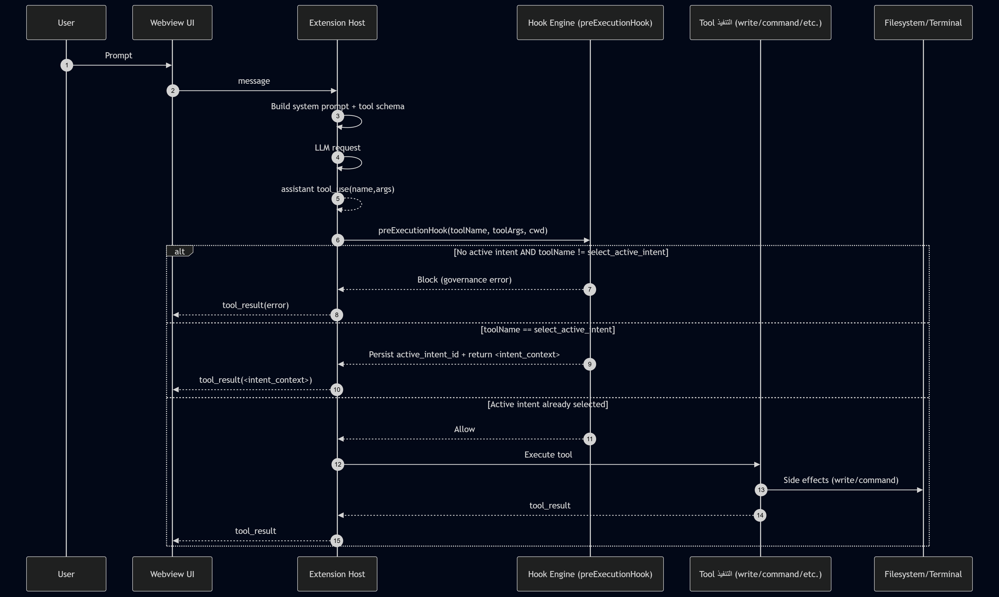

<!--
PDF styling tips:
- If using VS Code “Markdown PDF”, enable “markdown-pdf.styles” only if needed.
- Keep code fences and mermaid blocks; they export cleanly.
-->

<div style="text-align:center; margin-top: 3rem;">

# B1W1: Architecting the AI-Native IDE & Intent-Code Traceability

## Interim Submission Report — Architecture & Hook System

</div>

<div style="text-align:center; margin-top: 2rem; font-size: 1.05rem;">

**Course/Track:** 10 Academy — TRP1 Intensive Training \\
**Theme:** Architecting the AI‑Native IDE & Intent‑Code Traceability \\
**Codebase:** Fork of Roo Code (VS Code agent extension)

</div>

<div style="margin-top: 2.5rem;">

**Author:** _(Kirubel Tewodros)_  
**Date:** 2026‑02‑18  
**Fork Repository:** https://github.com/78gk/Roo-Code  
**Interim PR:** https://github.com/78gk/Roo-Code/pull/1  
**Branch:** `feature/intent-handshake`  
**Commit (report authored against):** `86da5dc4d7c032dbab45800440e88eac35e47088`

</div>

---

## Interim Deliverables Summary (Wednesday 21:00 UTC)

- **PDF report** exported from this report (`INTERIM_REPORT.md`) and uploaded to the course portal.
- **GitHub fork** pushed and accessible: https://github.com/78gk/Roo-Code
- **PR (recommended for review):** https://github.com/78gk/Roo-Code/pull/1
- **Repository includes:**
    - `src/hooks/` (hook middleware boundary)
        - `src/hooks/engine.ts`
        - `src/hooks/preToolHook.ts`
        - `src/hooks/postToolHook.ts`
    - `.orchestration/active_intents.yaml` (sample sidecar)
    - `ARCHITECTURE_NOTES.md` (Phase 0 findings)
- **Evidence included in this PDF:**
    - tool loop + prompt builder insertion points
    - hook decisions (PreToolUse vs PostToolUse)
    - at least one architecture diagram + schemas

---

## Table of Contents

1. [Executive Summary](#1-executive-summary)
2. [Extension Overview (How it Works)](#2-extension-overview-how-it-works)
3. [Architecture Notes (Phase 0 Findings)](#3-architecture-notes-phase-0-findings)
4. [Hook Engine Decisions (Why These Hook Points)](#4-hook-engine-decisions-why-these-hook-points)
5. [Diagrams](#5-diagrams)
6. [Schemas](#6-schemas)
7. [Verification & Evidence](#7-verification--evidence)
8. [Day 3 Execution Checklist (Phase 2)](#8-day-3-execution-checklist-phase-2)
9. [Known Gaps & Planned Next Steps](#9-known-gaps--planned-next-steps)

---

## List of Figures

- **Figure 1.** Hook engine privilege boundary (User → Webview → Extension Host → Hook Engine → Tool → Filesystem/Terminal)
- **Figure 2.** Two-stage intent handshake flow (select intent → persist → minimal intent_context → allow subsequent tools)

---

## 1) Executive Summary

This interim submission documents the architecture and implementation of a governed “AI‑native IDE” workflow in a fork of the Roo Code VS Code extension.

**Interim scope (Days 1–2):**

- Phase 0: repository archaeology and architecture mapping (tool loop, prompt builder, hook insertion points)
- Phase 1: an **intent-first handshake** enforced via a deterministic **pre-execution hook boundary**

**What is implemented in the fork:**

- A new native tool: `select_active_intent(intent_id)`
- A deterministic pre-tool “hook engine” entry point (`preExecutionHook`) that:
    - blocks all other tools until a valid intent is selected
    - intercepts `select_active_intent`, loads `.orchestration/active_intents.yaml`, sets `active_intent_id`, and returns minimal `<intent_context>` (constraints + scope)
- A focused unit test verifying the gating behavior
- Architecture documentation in `ARCHITECTURE_NOTES.md`

**Why this matters:** System prompts alone are probabilistic; hooks are deterministic. The hook boundary provides a privilege-separating control plane between LLM-driven tool requests and real side effects (filesystem/terminal).

---

## 2) Extension Overview (How it Works)

### 2.1 Runtime components

At a high level, Roo Code is composed of:

- **Webview UI (chat/task panel):** user interacts, sees assistant messages, tool progress.
- **Extension Host (TypeScript):** the extension runtime that:
    - constructs prompts and tool schemas
    - sends LLM requests
    - receives streaming assistant messages
    - executes tool calls (terminal, filesystem, etc.)

### 2.2 Message and tool execution flow (conceptual)

1. User submits a prompt in the webview.
2. Extension Host builds a **system prompt** and tool catalog for the model.
3. The model responds with either plain text or a `tool_use` block.
4. When a `tool_use` is received, the extension dispatches it to a tool handler.
5. **Before the tool is executed**, the pre-execution hook boundary is invoked to enforce governance.

---

## 3) Architecture Notes (Phase 0 Findings)

The full Phase 0 notes are tracked here:

- `ARCHITECTURE_NOTES.md`

This section summarizes the key findings required for the interim PDF.

### 3.1 Tool execution loop (where side effects happen)

**Dispatcher:**

- `src/core/assistant-message/presentAssistantMessage.ts`

**Observed pattern:**

- The extension receives assistant blocks (text + tool_use).
- Tool calls are routed via a `switch` on the tool name.
- Each tool is implemented as a class with a `handle()` method, commonly via `BaseTool.handle()`.

**Why this is the governance seam:**

- This is the single, deterministic choke point where tool requests transition into privileged operations.

### 3.2 Prompt builder (where we instruct the handshake)

**System prompt builder:**

- `src/core/prompts/system.ts` (function `SYSTEM_PROMPT(...)`)

**System prompt assembly entry point:**

- `src/core/webview/generateSystemPrompt.ts`

**Key interim change:**

- The system prompt contains explicit handshake language requiring `select_active_intent` as the first action.

### 3.3 Hook insertion point (middleware boundary)

**Pre-execution hook:**

- `src/hooks/pre-execution.ts` (function `preExecutionHook(...)`)

**Wiring:**

- Called from `src/core/assistant-message/presentAssistantMessage.ts` before tools execute.

---

## 4) Hook Engine Decisions (Why These Hook Points)

### 4.1 Why PreToolUse / pre-execution is the correct control point

The research and challenge docs emphasize deterministic hooks because:

- System prompts can be ignored.
- A hook is executed regardless of model behavior.

**We place the governance boundary at “pre tool execution”** because that is the earliest point where we can:

- refuse tool usage when no intent is selected
- block potentially destructive actions (future Day 3)
- enforce scope rules before filesystem writes occur (future Day 3)

### 4.2 Why PostToolUse matters (planned for Day 4)

Post-execution hooks are planned for traceability:

- append-only Agent Trace JSONL records
- deterministic SHA-256 hashing of inserted blocks

**Decision:** pre-execution enforces authorization and constraints; post-execution records evidence.

---

## 5) Diagrams

### Figure 1 — Hook engine privilege boundary (User → Webview → Hook → Tool)



```

### Figure 2 — Intent handshake (two-stage)
```


```

---
```

## 6) Schemas

### 6.1 Sidecar: `.orchestration/active_intents.yaml`

**Location (repo):** `.orchestration/active_intents.yaml`  
**Purpose:** a small, machine-managed registry of available intents and the currently selected `active_intent_id`.

**Shape (current implementation supports multiple variants):**

```yaml
active_intent_id: "day2-handshake" | null
intents:
  - id: "day2-handshake"
    title: "Day 2: Intent Handshake"
    summary: "..."
    scope:
      paths:
        - "roo-code/src/**"
        - ".orchestration/**"
    constraints:
      - "Keep injected intent context minimal (constraints + scope only)."
```

### 6.2 Tool result contract: `<intent_context>` (minimal)

On a successful handshake, the hook returns a minimal context block.

```xml
<intent_context>
  <id>day2-handshake</id>
  <title>Day 2: Intent Handshake</title>
  <constraints>
    <c>Keep injected intent context minimal (constraints + scope only).</c>
  </constraints>
  <scope>
    <path>roo-code/src/**</path>
    <path>.orchestration/**</path>
  </scope>
</intent_context>
```

### 6.3 Agent Trace schema (planned for Phase 3 / Day 4)

Even if the file is empty at interim time, the design requires an append-only JSONL ledger:

- `.orchestration/agent_trace.jsonl`

**Proposed record shape (JSONL):**

```json
{
	"timestamp": "2026-02-18T15:30:00.000Z",
	"intent_id": "day2-handshake",
	"tool": "write_to_file",
	"target": "roo-code/src/...",
	"ranges": [
		{
			"content_hash": "sha256:...",
			"start": { "line": 10, "character": 0 },
			"end": { "line": 20, "character": 0 }
		}
	],
	"related": [{ "type": "intent", "id": "day2-handshake" }]
}
```

---

## 7) Verification & Evidence

### 7.1 Key PR

- https://github.com/78gk/Roo-Code/pull/1

### 7.2 Key files (evidence)

- Intent hook engine: `src/hooks/pre-execution.ts`
- Tool loop boundary: `src/core/assistant-message/presentAssistantMessage.ts`
- Tool schema: `src/core/prompts/tools/native-tools/select_active_intent.ts`
- Tool implementation: `src/core/tools/SelectActiveIntentTool.ts`
- Sidecar file: `.orchestration/active_intents.yaml`
- Test: `src/core/assistant-message/__tests__/presentAssistantMessage-intent-gating.spec.ts`

### 7.3 Test command (focused)

```bash
pnpm vitest run src/core/assistant-message/__tests__/presentAssistantMessage-intent-gating.spec.ts
```

---

## 8) Day 3 Execution Checklist (Phase 2)

**Goal (Phase 2):** HITL command gating + scope enforcement (and interim report readiness).

- [ ] Classify commands/tools as **Safe** vs **Destructive**
- [ ] Require explicit approval UI for destructive actions (Approve/Reject)
- [ ] Enforce write scope against intent-owned paths
- [ ] Maintain hook logic inside `src/hooks/` (keep core loop thin)

---

## 9) Known Gaps & Planned Next Steps

### Implemented now (Phase 1)

- Intent handshake tool
- Deterministic pre-execution gating
- Minimal intent context injection

### Not yet implemented (planned)

- Phase 2 (Day 3): destructive command HITL + scope enforcement
- Phase 3 (Day 4): agent trace JSONL + deterministic SHA-256 content hashing
- Phase 4/5: parallel orchestration safeguards (optimistic locking; stale write rejection)

---

**Appendix:** For deeper Phase 0 tracing details and exact functions, see `ARCHITECTURE_NOTES.md`.
